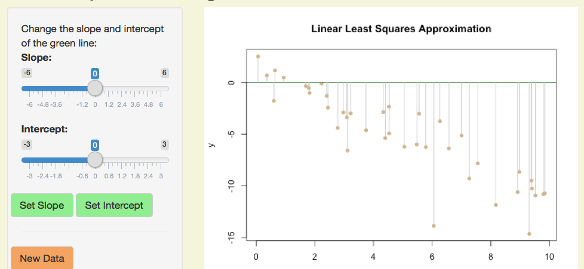

```{r setup, include=FALSE}
knitr::opts_chunk$set(echo = FALSE)
```

## Linear Least Squares

Given a set of points $(x_i, y_i)$ in the plane, we want to find a linear function
$$ L(x) = m x  + b $$
which predicts the $y$-coordinate using the $x$-coordinate, so that
$$ L(x_i) = m x_i + b \approx y_i$$
We want to choose coefficients $m$ and $b$ to minimize the *sum of the squared errors* (SSE):
$$ [L(x_1)-y_1]^2 + [L(x_2)-y_2]^2 + \dots + [L(x_n)-y_n]^2 $$

## Estimating m and b

The app generates 40 points and a line:

```{r, out.width = "500px"}

``` 

- Errors (distance of points from the line) are drawn in grey.
- Adjust the slope ($m$) and intercept ($b$) of the line with the sliders.
- Try to make the line similar to the data.


## Measuring Error

Recall we measure error with the *sum of squared errors* (SSE), or the square of the 
vertical distances (grey lines) from the data points to the line.

The current SSE is printed below the graph, together with the smallest SSE you 
have found so far, and the slope and intercept used:

```{r, out.width = "500px"}

``` 

This can be used to help identify which slope and intercept are the best fit.

## Other Options

- **Fix Slope or Intercept:** Clicking "Set Intercept" will set the intercept 
to the value found by Rs built-in `lm` function.  Similarly, "Set Slope" will 
set the slope.  This allows you to try to vary only *one* parameter.

Here is an example of how R can find the slope and intercept of the best fit 
line using data involving normal errors:

```{r, echo=TRUE}
x = runif(40, min=0, max=10); y=2*x+3+rnorm(40)
coef(lm(y~x))
```

- New Data:  Clicking "New Data" will generate a new set of data and reset all 
parameters.


